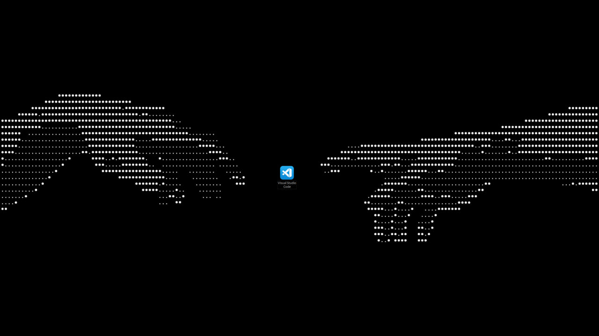

  

  <h1 align="center" style="border-bottom: none; font-size: 2.5em; font-weight: 700; color: #ffffff; margin-bottom: 10px;">Привет, я w1n4a 🕊️</h1>
  

    Обычный инди-разработчик. Делаю свои небольшие проги, пилю разные полезные штуки и стараюсь, чтобы интерфейс в программах был удобным и не бесил при использовании.
  

## 🪐 Немного обо мне

Мне 13 лет, учусь в школе, а всё свободное время трачу на кодинг. Программирование - это по сути моё главное увлечение. Очень люблю копаться в кодовой базе, придумывать свои решения и разбираться, как всё устроено изнутри. Предпочитаю работать в одиночку, потому что так получается быстрее, проще сосредоточиться и делать софт именно таким, каким я его вижу.

---

## 📦 Главный проект: CTkPlus

  

    <b>CTkPlus</b> - это моя собственная библиотека для Python, которая расширяет обычный CustomTkinter. Мне надоело каждый раз собирать сложные элементы с нуля, поэтому я пишу готовые виджеты. Их можно просто импортировать в свой проект и не тратить время на подгонку пикселей. Пакет уже выложил на <b>PyPI</b>, пока что это бета-версия.
  

  
  <h3 style="color: #58a6ff; margin-top: 20px; margin-bottom: 10px;">Что уже готово:</h3>
  <ul style="color: #c9d1d9; line-height: 1.6; padding-left: 20px;">
    <li><b>CTkEntryButton:</b> Строка ввода, в которую сразу встроена кнопка. Удобно для поиска или отправки текста, чтобы не выравнивать два отдельных виджета в сетке.</li>
    <li><b>CTkSpinBox:</b> Нормальный выбор чисел стрелочками с настройкой шага. Странно, что в оригинальном CustomTkinter такого до сих пор нет из коробки.</li>
    <li><b>CTkSelector:</b> Кастомный компонент для удобного выбора элементов или переключения режимов внутри интерфейса.</li>
  </ul>
  
  <h3 style="color: #58a6ff; margin-top: 20px; margin-bottom: 10px;">Планы и обновления:</h3>
  

    Я собираюсь выпускать частые обновления и постепенно добавлять сюда целую кучу новых кастомных виджетов. Если у вас есть идеи, каких элементов не хватает в CustomTkinter, или вы хотите предложить свои варианты - пишите мне прямо на почту, обсудим.
  

## 🛠️ Технологический стек & Навыки

**Python** • **CustomTkinter** • **Telegram Bot (telebot)** • **Lua** • **Godot (GDScript)** • **Linux**

<table width="100%" style="border-collapse: collapse; border: none; margin-top: 25px;">
  <tr style="border: none; background: transparent;">
    <td width="50%" style="border: none; padding: 0 10px 0 0; vertical-align: top;">
      
Разработка интерфейсов

      
Создание кастомных виджетов на CustomTkinter, настройка геометрии окон и стилей.

    </td>
    <td width="50%" style="border: none; padding: 0 0 0 10px; vertical-align: top;">
      
Автоматизация и инструменты

      
Написание Telegram-ботов на telebot, публикация пакетов на PyPI, работа с Git.

    </td>
  </tr>
</table>
