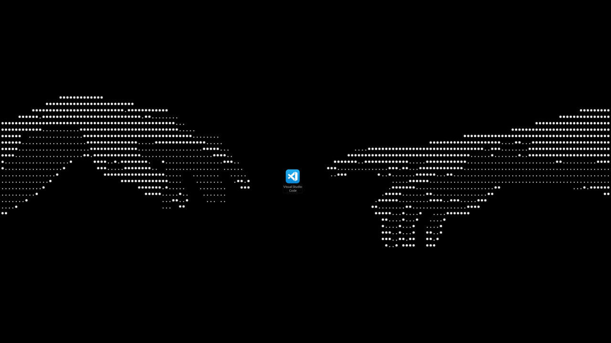

  

<h1 align="center">Hey there, I'm w1n4a 🕊️</h1>

  

  Welcome! I am a 13-year-old independent developer deeply passionate about exploring codebases, building custom tools, and understanding how things work under the hood. I specialize in crafting desktop interfaces, backend automation, and custom software libraries.

---

### 📦 Spotlight Project: CTkPlus
**CTkPlus** is an extension library for **CustomTkinter (Python)** designed to eliminate UI boilerplate. Instead of building complex interface elements from scratch, CTkPlus provides clean, production-ready custom widgets that can be instantly imported into any project.

* 🚀 **Currently Released:** Beta version available on [PyPI](https://pypi.org).
* 🎨 **Ready-to-use Widgets:**
  * `CTkEntryButton` – A seamless text entry field with an integrated button, perfect for search bars.
  * `CTkSpinBox` – A robust numerical selector with adjustable steps, filling a major gap in stock CustomTkinter.
  * `CTkSelector` – An intuitive custom component for switching states or navigating layout views.
* 🔮 **Roadmap:** Active development is underway to introduce a comprehensive suite of advanced UI components.

---

### 🛠️ Tech Stack & Toolkit

  <!-- Languages -->
  
  
  
  
   
  <!-- Frameworks & Tools -->
  
  
  

#### Core Expertise:
* **GUI Architecture:** Designing highly responsive, custom styled desktop applications with CustomTkinter.
* **System Programming & Math:** Building high-performance algorithms, system utilities, and data pipelines in Rust.
* **Automation & Distribution:** Developing Telegram bots (`telebot`), managing Git workflows, and publishing open-source packages to PyPI.

---

### 📬 Get in Touch
Have a feature request for **CTkPlus**, want to collaborate, or just talk shop about code? Drop an issue in my repositories or hit me up via email!
